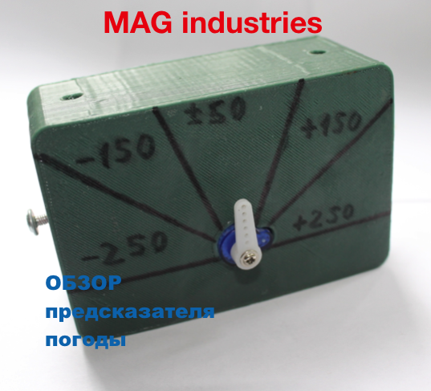
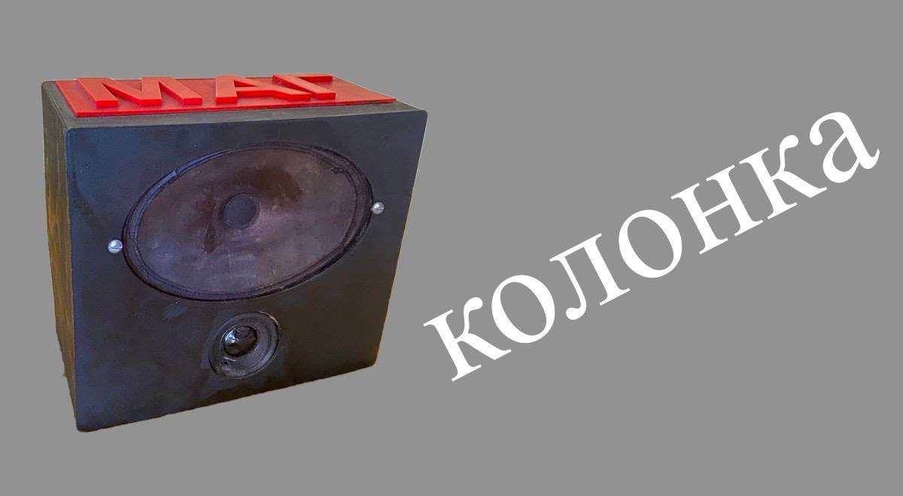

<html lang="ru">
<head>
    <meta charset="UTF-8">
    <meta name="viewport" content="width=device-width, initial-scale=1.0">
    <meta name="author" content="Glushnev Mikhail Alekseevich">
    <meta name="description" content="MAG Industries – наши видео, TikTok, YouTube, связь с нами">
    <meta name="keywords" content="MAG industries, видео, TikTok, YouTube, стартап, технологии, 3D-принтер, Arduino, автомобили">
    <title>MAG Industries | Видео и связь</title>
    
    <link rel="preconnect" href="https://fonts.googleapis.com">
    <link rel="preconnect" href="https://fonts.gstatic.com" crossorigin>
    <link href="https://fonts.googleapis.com/css2?family=Montserrat:wght@400;600;700&family=Roboto:wght@300;400&display=swap" rel="stylesheet">
    
    
</head>
<body>

    <a href="https://mag858.github.io/MAG-industries/" class="back-btn">← На главную</a>

    <section class="hero">
        
        <h1>future - right now</h1>
        
(будущее - прямо сейчас)

    </section>

    <section class="section">
        <h2>НАШИ ВИДЕО</h2>
        <small>(кликай на них)</small>
        
        

            

                
            

            

                
            

            

                
            

        

    </section>

    <section class="section">
        <h2>СВЯЗЬ С НАМИ</h2>
        
        

            
            
        

        
        

            <a href="mailto:magind000@gmail.com">почта: magind000@gmail.com</a>
        

    </section>

    <footer>
        обновление 3.1 &emsp; январь 2026 г.
    </footer>

</body>
</html>	
		
